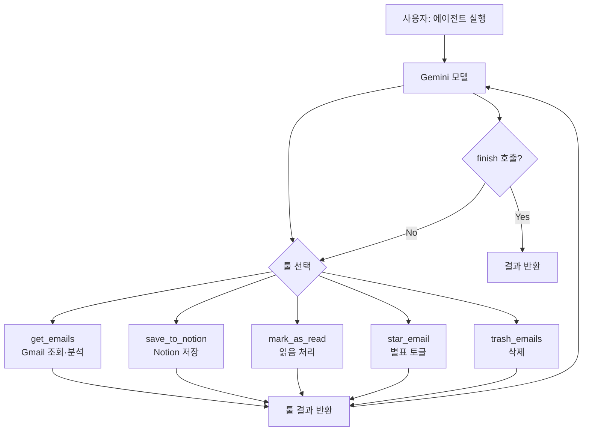

# 📧 이메일 분류 에이전트

Gmail 받은편지함을 Gemini AI 에이전트가 자동으로 분석·분류·저장하는 웹 앱입니다.
에이전트가 이메일 조회부터 AI 분석, Notion 저장까지 한 번에 처리합니다.

## 주요 기능

- **에이전트 실행** — 버튼 하나로 이메일 조회·AI 분석·Notion 저장을 자동 처리
- **중요도 분류** — 🔴 지금 처리 / 📋 확인 필요 / 🗂️ 나머지 3섹션으로 자동 분리
- **요약 카드** — 답장 필요 건수, 긴급 건수, 최우선 메일을 한눈에 표시
- **AI 분석** — 카테고리, 중요도(1~10), 광고 여부, 답장 필요 여부, 한줄 요약, 답장 초안 생성
- **기간 조회** — 날짜 범위로 메일 필터링
- **선택 작업** — 카드/카테고리 배지 클릭으로 다중 선택 후 읽음 처리·삭제
- **별표 토글** — Gmail 별표편지함에 바로 추가/제거
- **필터** — 광고 숨기기, 중요도 슬라이더

## 에이전트 아키텍처

Gemini 모델이 툴 호출을 통해 이메일 작업을 자율적으로 수행합니다.



| 툴 | 설명 |
|----|------|
| `get_emails` | Gmail INBOX에서 이메일을 가져와 AI로 분석 |
| `save_to_notion` | 분석된 이메일을 Notion 데이터베이스에 저장 |
| `mark_as_read` | 지정한 이메일을 읽음으로 표시 |
| `star_email` | 이메일 별표 토글 |
| `trash_emails` | 이메일을 휴지통으로 이동 |
| `finish` | 모든 작업 완료 후 최종 결과 반환 |

## 기술 스택

| 영역 | 기술 |
|------|------|
| 프론트엔드 | React 18, Vite, Tailwind CSS |
| 백엔드 | Node.js, Express |
| AI | Google Gemini 2.5 Flash Lite |
| 이메일 | Gmail API (OAuth 2.0) |
| 저장 | Notion API |

## 시작하기

### 1. 의존성 설치

```bash
npm install
```

### 2. 환경변수 설정

프로젝트 루트에 `.env` 파일을 만들고 아래 값을 채웁니다.

```env
# Gmail OAuth2
GMAIL_CLIENT_ID=
GMAIL_CLIENT_SECRET=
GMAIL_REDIRECT_URI=http://localhost:3000/auth/callback

# Gemini AI
GEMINI_API_KEY=

# Notion
NOTION_API_KEY=
NOTION_DATABASE_ID=
```

#### Gmail OAuth2 설정
1. [Google Cloud Console](https://console.cloud.google.com) → 새 프로젝트 생성
2. Gmail API 활성화
3. OAuth 2.0 클라이언트 ID 생성 (웹 애플리케이션)
4. 승인된 리디렉션 URI에 `http://localhost:3000/auth/callback` 추가

#### Gemini API 설정
1. [Google AI Studio](https://aistudio.google.com) → API 키 발급

#### Notion 설정
1. [Notion Integrations](https://www.notion.so/my-integrations) → 새 통합 생성
2. 저장할 데이터베이스에 통합 연결
3. 데이터베이스 URL에서 ID 복사 (`notion.so/.../{DATABASE_ID}?v=...`)

### 3. 실행

```bash
npm run dev
```

- 프론트엔드: http://localhost:5173
- 백엔드: http://localhost:3000

## 사용 방법

1. 브라우저에서 `http://localhost:5173` 접속
2. **Google 계정으로 연결** 클릭 → Gmail 인증
3. 날짜 범위 설정 후 **에이전트 실행** 클릭
4. 에이전트가 이메일 조회 → AI 분석 → Notion 저장을 자동 처리
5. 완료 후 섹션별로 메일 확인, 필요시 읽음 처리·삭제·별표 지정

## 프로젝트 구조

```
email-agent/
├── server/
│   ├── index.js              # Express 서버 (Gmail, Gemini, Notion API)
│   └── agent/
│       ├── tools.js          # 툴 선언 및 시스템 프롬프트
│       ├── executor.js       # 툴 실행기
│       └── loop.js           # 에이전트 루프
├── src/
│   ├── api/
│   │   └── index.js          # 백엔드 API 호출 함수
│   ├── components/
│   │   ├── EmailCard.jsx     # 이메일 카드
│   │   ├── EmailList.jsx     # 트리아지 섹션 목록
│   │   ├── ReplyDraft.jsx    # 답장 초안 토글
│   │   └── SummaryCard.jsx   # 분석 요약 카드
│   └── App.jsx               # 메인 앱
└── .env                      # 환경변수 (git 제외)
```
